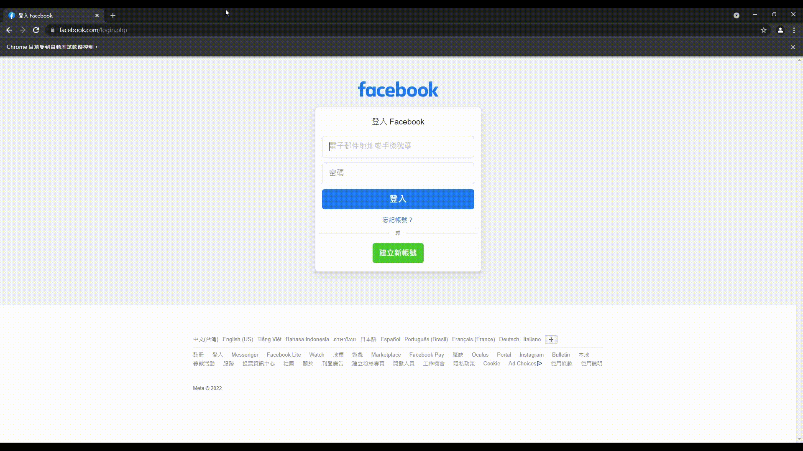

<div id="top"></div>

<!-- PROJECT LOGO -->
<br />
<div align="center">
  <a href="https://github.com/RUI-LONG/a_monkey_a_day_keeps_kevin_away">
    
  </a>

  <h3 align="center">A Monkey A Day Keeps Kevin Away !</h3>

  <p align="center">
    The best prank ever (2022)
    <br />
    <br />
    <a href="images/demo.gif">View Demo</a>
    ·
    <a href="https://github.com/RUI-LONG/a_monkey_a_day_keeps_kevin_away/issues">Report Bug</a>
    ·
    <a href="https://github.com/RUI-LONG/a_monkey_a_day_keeps_kevin_away/issues">Request Feature</a>
  </p>
</div>

<p align="center">

<p>

<!-- ABOUT THE PROJECT -->
## About The Project

This is an awesome project, which can automatic login Facebook and send random monkey image to a friend / colleague.

Here's the reason why I made this:
* I have a colleague named Kevin, he is a monkey.

<p align="center">

<p>

So I decided to waste three hours writing this project.

If you also have a colleague who is a monkey, welcome to the zoo !

</br>

<!-- GETTING STARTED -->
## Getting Started

### Installation

1. Clone the repo
   ```sh
   git clone https://github.com/RUI-LONG/a_monkey_a_day_keeps_kevin_away.git
   ```
2. Install packages
   ```
   pip install -r requirements.txt
   ```
  
### Setup
1. Open send_message.py, change OOOOO to your account email and password.</br></br>
    <b>Attention: Don't share your account email and password !</b></br>
    ```
    email = "OOOOOOOOOOO@gmail.com"
    pwd = "OOOOOOOOOOO"
    ```

2. Change OOOOO to your friend's Facebook message url

    ```
    msg_url = "https://www.facebook.com/messages/t/OOOOOOOOOOO"
    ```

<p align="right">(<a href="#top">back to top</a>)</p>

<!-- USAGE EXAMPLES -->
## Usage
Simply RUN:
```
python send_message.py
```

<!-- CONTRIBUTING -->
## Contributing

Contributions are what make the open source community such an amazing place to learn, inspire, and create. Any contributions you make are **greatly appreciated**.

If you have a suggestion that would make this better, please fork the repo and create a pull request. You can also simply open an issue with the tag "enhancement".
Don't forget to give the project a star! Thanks again!

1. Fork the Project
2. Create your Feature Branch (`git checkout -b feature/iamamonkey`)
3. Commit your Changes (`git commit -m 'Add some iamamonkey'`)
4. Push to the Branch (`git push origin feature/iamamonkey`)
5. Open a Pull Request

<p align="right">(<a href="#top">back to top</a>)</p>


<!-- ACKNOWLEDGMENTS -->
## Acknowledgments

* [Python Login Facebook](https://www.askpython.com/python/examples/python-automate-facebook-login)


<p align="right">(<a href="#top">back to top</a>)</p>


<!-- MARKDOWN LINKS & IMAGES -->
<!-- https://www.markdownguide.org/basic-syntax/#reference-style-links -->
[product-screenshot]: images/screenshot.png